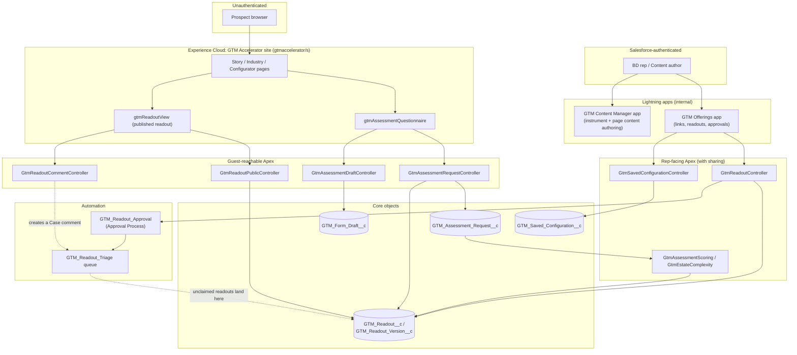
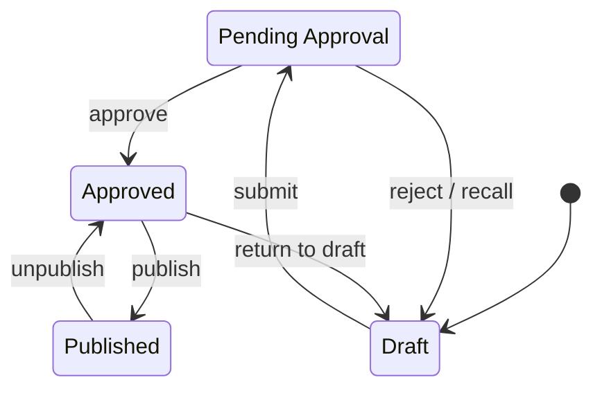

# Architecture overview

GTM Offerings is a single Salesforce DX application: two internal Lightning
apps for the reps and content authors who run engagements, and one guest-
facing Experience Cloud site for the prospects on the other end of a link.
The whole build lives in `force-app/`, deploys with the `sf` CLI, and runs in
one org — there is no separate service tier, database, or hosting layer
outside Salesforce. See `CLAUDE.md` for the org, stack, and deploy
conventions; this file is the "what talks to what" map for a reader who
wants the shape before the detail.

## Containers

Guest traffic never reaches the rep-facing controllers (`GtmReadoutController`,
`GtmSavedConfigurationController`) — Apex class access is granted per class in
the guest permission sets, and only the four guest-reachable controllers above
are in them. Internal users reach the same underlying objects through the two
Lightning apps, `GTM Offerings` (links, readouts overview/manager, approvals)
and `GTM Content Manager` (Content Home, Content Manager, Instrument Author).

## The readout's status lifecycle

`GTM_Readout__c.Status__c` moves through a fixed set of states, gated partly
by Apex (`GtmReadoutController`) and partly by Salesforce's own native
Approval Process — approving a readout never happens inside the rep's editor,
deliberately, so a rep cannot approve their own readout.

`approve` happens off-platform, in Salesforce's own Approval Process UI (email,
bell notification, mobile) — no Apex method drives that edge. Every other edge
is a named method on `GtmReadoutController` (`submitForApproval`,
`recallApproval`, `publishReadout`, `unpublishReadout`, `returnToDraft`).
Published never goes straight back to Draft — the token is live in a
prospect's inbox, so the only way back is Unpublish (which revokes the token
and lands on Approved) followed by Return to draft. Full detail, including
the review-Case and triage-queue mechanics, lives in
`docs/runbooks/readout-public-link.md`.

## The instrument build pipeline

The assessment questionnaire's content — questions, scoring weights, gates,
and branching pairs — is authored as YAML under
`migration-accelerator/instrument/*.yaml`, not hand-edited as metadata.
`scripts/build-instrument.py` compiles that YAML into the custom metadata
records under `force-app/main/default/customMetadata/GTM_Assessment_*`, which
then deploy like any other metadata. Run `python3 scripts/build-instrument.py
--check` to validate the YAML and catch drift between it and the generated
XML before deploying. The full authoring model — the L0–L4 layer system and
`show_when` branching — is documented in
`docs/runbooks/assessment-instrument.md`; this file states only the pipeline
shape.

## The two guest surfaces, and their security posture

**The assessment questionnaire.** The one guest write path onto a submission
is `GtmAssessmentRequestController.submitRequest` — no other guest-reachable
method can create a `GTM_Assessment_Request__c`. A respondent who leaves
mid-form is carried by `GtmAssessmentDraftController` against a separate
`GTM_Form_Draft__c` object, addressed only by an unguessable
`Resume_Token__c` filtered in the SOQL `WHERE` clause — no method on that
controller accepts a record Id. Neither guest-reachable object grants guest
object or field permissions in `GTM_Assessment_Guest`; Apex runs the actual
reads and writes in system mode, and granting object access on top would open
a second, token-free path onto the same data via LDS or list views.

**The published readout.** `GtmReadoutPublicController.getPublishedReadout`
is the only guest-reachable path onto `GTM_Readout__c`, runs `without
sharing`, and filters `Status__c = 'Published' AND Public_Link_Token__c =
:token` in the query itself, returning a wrapper class rather than an
SObject. `GtmReadoutCommentController` is the matching write path, landing
a guest's comment on the readout's review Case. As with the questionnaire,
`GTM_Assessment_Guest`/`GTM_Story_Guest` grant no object or field permission
on `GTM_Readout__c` or `Case` — access is class-level only, and the
permission sets carry inline comments not to re-add it. Full detail,
including the 14-step smoke test, lives in
`docs/runbooks/readout-public-link.md`.
