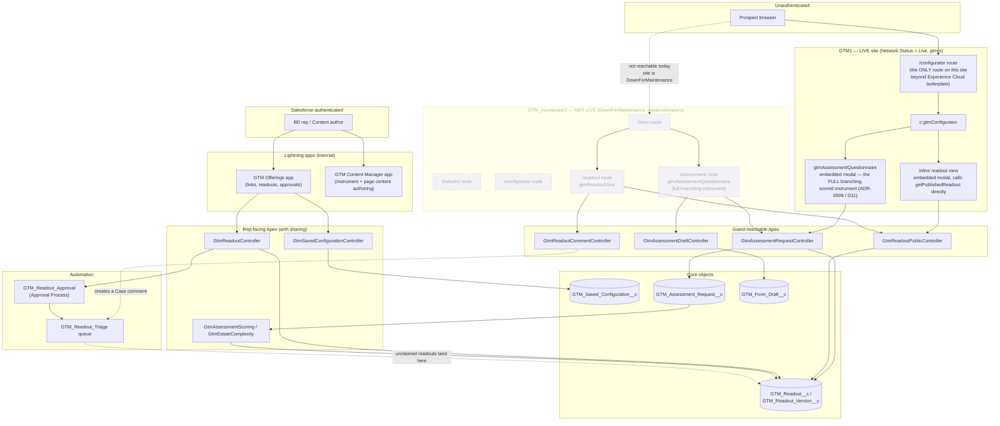
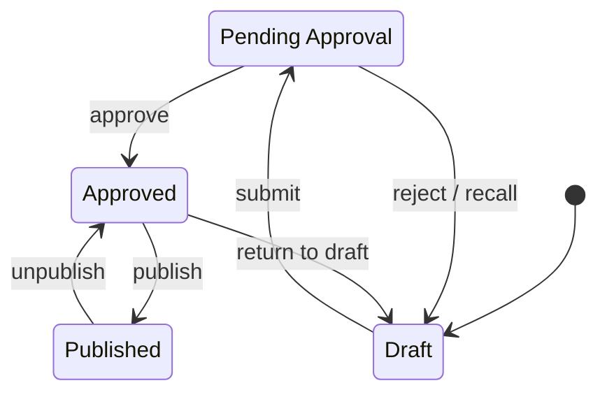

# Architecture Overview: GTM Offerings

GTM Offerings is a single-org Salesforce DX application comprising two internal Lightning apps (for reps and content authors) and an external guest-facing Experience Cloud site for prospects. There is no separate service tier, database, or external hosting layer.

---

## 1. Container & Route Topology

### Critical Route Constraints

- **GTM1 (Live Site):** Only the `/configurator` route is functional. It renders `c:gtmConfigurator`, which handles both guest assessments (`c:gtmAssessmentQuestionnaire`) and the published-readout view via inline modal overlays. There are **no** separate standalone `/assessment` or `/readout` pages.
- **Context Preservation (ADR-0008):** Standalone routes cannot track the engagement link's `savedRecordId`. If a sub-agent breaks the modal overlay structure, submissions become un-attributable and un-scored.
- **GTM_Accelerator1 (Dark Site):** Status is set to `DownForMaintenance`. The story, industry, questionnaire, and readout routes exist in source code but are completely unreachable by prospects. Per **ADR-0006**, route reachability must always be cross-referenced with `Network.Status`.

---

## 2. Security & Data Isolation Boundaries

- **Guest Context Gate:** Unauthenticated internet traffic can only reach the four controllers registered in the guest permission sets (`GtmAssessmentRequestController`, `GtmAssessmentDraftController`, `GtmReadoutPublicController`, `GtmReadoutCommentController`).
- **Internal User Gate:** Rep-facing controllers (`GtmReadoutController`, `GtmSavedConfigurationController`) enforce user authentication and `with sharing` record access visibility via internal Lightning Apps.

---

## 3. Readout Status Lifecycle

`GTM_Readout__c.Status__c` changes are gated across custom Apex methods (`GtmReadoutController`) and native Salesforce Approval Processes. Reps are explicitly barred from self-approving readouts inside the editing canvas.

### Lifecycle Edge Constraints

- **Native Platform Transitions:** The `approve` mechanism is handled off-platform by Salesforce's native approval notifications UI; no custom Apex method invokes this branch directly.
- **Token Invalidation Safety:** A `Published` readout cannot transition directly back to a `Draft`. Because a token is active in a prospect's inbox, you must explicitly invoke `unpublishReadout` (which revokes the token and defaults status back to `Approved`) before executing `returnToDraft`.

---

## 4. Assessment Instrument Compilation Pipeline

The questionnaire metadata (questions, expressions, scoring limits, branching rules) follows a continuous deployment compilation flow:

1. **Source Configuration:** Local YAML definitions live under `migration-accelerator/instrument/<offering-key>/*.yaml`.
2. **Compilation Step:** Running `scripts/build-instrument.py` parses these localized files and auto-compiles the output target records.
3. **Target Destination:** Compiles directly into `force-app/main/default/customMetadata/GTM_Assessment_*` XML structures.
4. **Agent Integrity Rule:** Sub-agents must never hand-edit the generated custom metadata XML files. Any direct alterations will be silently wiped out during the next local Python compilation pipeline invocation loop.
