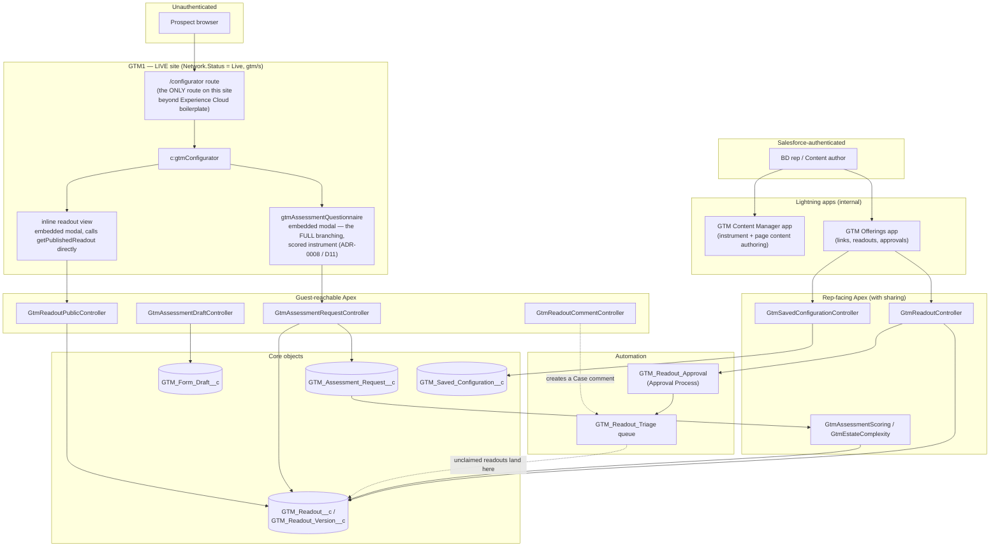
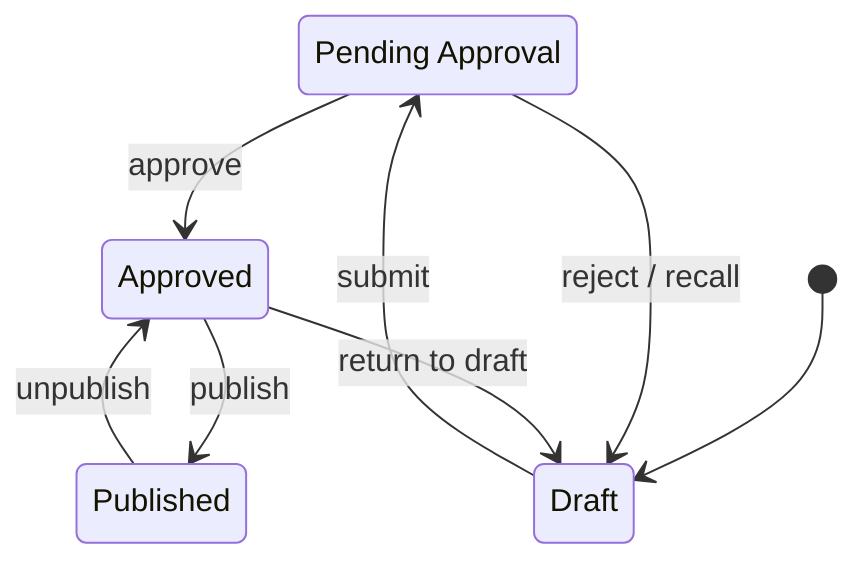

# Architecture Overview: GTM Offerings

GTM Offerings is a single-org Salesforce DX application comprising two internal Lightning apps (for reps and content authors) and an external guest-facing Experience Cloud site for prospects. There is no separate service tier, database, or external hosting layer.

---

## 1. Container & Route Topology

### Critical Route Constraints

- **GTM1 (Live Site):** Only the `/configurator` route is functional. It renders `c:gtmConfigurator`, which handles both guest assessments (`c:gtmAssessmentQuestionnaire`) and the published-readout view via inline modal overlays. There are **no** separate standalone `/assessment` or `/readout` pages.
- **Context Preservation (ADR-0008):** Standalone routes cannot track the engagement link's `savedRecordId`. If a sub-agent breaks the modal overlay structure, submissions become un-attributable and un-scored.
- **GTM_Accelerator1 / site-decommission — CLOSED (issue-TicketB-closeout):** The dark site's ExperienceBundle has been deleted from source; it no longer appears in the diagram above. Full Network/Site deletion is **not achievable through Salesforce's deploy pipeline** — a real `--dry-run` deploy against `gtm-prod` returned the platform's own error: *"You can't delete an Experience Cloud site, but you can deactivate it through the Administration settings in Experience Workspaces."* `Network.Status` has exactly three values (`UnderConstruction`/`Live`/`DownForMaintenance`) and `DownForMaintenance` is the platform's maximum inactive state — there is no further "deleted" or "archived" state to move to. In `gtm-prod`, both `GTM_Accelerator1` (`0DBgK000001qLFtWAM`) and a second, org-only site with no repo-side bundle (`0DBgK000001qFVRWA2`, site prefix `gtmframework` — this repo's source never tracked it) have been renamed with a `ZZ DELETE -` prefix for Setup UI visibility; both remain `DownForMaintenance`. `GTM1` has full content parity (see `docs/backlog.md` D9), so nothing further is pending — this decommission effort is closed.

---

## 2. Security & Data Isolation Boundaries

- **Guest Context Gate:** Unauthenticated internet traffic can only reach the four controllers registered in the guest permission sets (`GtmAssessmentRequestController`, `GtmAssessmentDraftController`, `GtmReadoutPublicController`, `GtmReadoutCommentController`).
- **Internal User Gate:** Rep-facing controllers (`GtmReadoutController`, `GtmSavedConfigurationController`) enforce user authentication and `with sharing` record access visibility via internal Lightning Apps.

---

## 3. Readout Status Lifecycle

`GTM_Readout__c.Status__c` changes are gated across custom Apex methods (`GtmReadoutController`) and native Salesforce Approval Processes. Reps are explicitly barred from self-approving readouts inside the editing canvas.

### Lifecycle Edge Constraints

- **Native Platform Transitions:** The `approve` mechanism is handled off-platform by Salesforce's native approval notifications UI; no custom Apex method invokes this branch directly.
- **Token Invalidation Safety:** A `Published` readout cannot transition directly back to a `Draft`. Because a token is active in a prospect's inbox, you must explicitly invoke `unpublishReadout` (which revokes the token and defaults status back to `Approved`) before executing `returnToDraft`.

---

## 4. Assessment Instrument Compilation Pipeline

The questionnaire metadata (questions, expressions, scoring limits, branching rules) follows a continuous deployment compilation flow:

1. **Source Configuration:** Local YAML definitions live under `migration-accelerator/instrument/<offering-key>/*.yaml`.
2. **Compilation Step:** Running `scripts/build-instrument.py` parses these localized files and auto-compiles the output target records.
3. **Target Destination:** Compiles directly into `force-app/main/default/customMetadata/GTM_Assessment_*` XML structures.
4. **Agent Integrity Rule:** Sub-agents must never hand-edit the generated custom metadata XML files. Any direct alterations will be silently wiped out during the next local Python compilation pipeline invocation loop.
`approve` happens off-platform, in Salesforce's own Approval Process UI (email,
bell notification, mobile) — no Apex method drives that edge. Every other edge
is a named method on `GtmReadoutController` (`submitForApproval`,
`recallApproval`, `publishReadout`, `unpublishReadout`, `returnToDraft`).
Published never goes straight back to Draft — the token is live in a
prospect's inbox, so the only way back is Unpublish (which revokes the token
and lands on Approved) followed by Return to draft. Full detail, including
the review-Case and triage-queue mechanics, lives in
`docs/runbooks/readout-public-link.md`.

## The instrument build pipeline

The assessment questionnaire's content — questions, scoring weights, gates,
and branching pairs — is authored as YAML under
`instrument/<offering-key>/*.yaml`, not hand-edited as metadata.
`scripts/build-instrument.py` compiles that YAML into the custom metadata
records under `force-app/main/default/customMetadata/GTM_Assessment_*`, which
then deploy like any other metadata. Run `python3 scripts/build-instrument.py
--check` to validate the YAML and catch drift between it and the generated
XML before deploying. The full authoring model — the L0–L4 layer system and
`show_when` branching — is documented in
`docs/runbooks/assessment-instrument.md`; this file states only the pipeline
shape.

## The two guest surfaces, and their security posture

**The assessment questionnaire.** The one guest write path onto a submission
is `GtmAssessmentRequestController.submitRequest` — no other guest-reachable
method can create a `GTM_Assessment_Request__c`. A respondent who leaves
mid-form is carried by `GtmAssessmentDraftController` against a separate
`GTM_Form_Draft__c` object, addressed only by an unguessable
`Resume_Token__c` filtered in the SOQL `WHERE` clause — no method on that
controller accepts a record Id. Neither guest-reachable object grants guest
object or field permissions in `GTM_Assessment_Guest`; Apex runs the actual
reads and writes in system mode, and granting object access on top would open
a second, token-free path onto the same data via LDS or list views.

**The published readout.** `GtmReadoutPublicController.getPublishedReadout`
is the only guest-reachable path onto `GTM_Readout__c`, runs `without
sharing`, and filters `Status__c = 'Published' AND Public_Link_Token__c =
:token` in the query itself, returning a wrapper class rather than an
SObject. `GtmReadoutCommentController` is the matching write path, landing
a guest's comment on the readout's review Case. As with the questionnaire,
`GTM_Assessment_Guest`/`GTM_Story_Guest` grant no object or field permission
on `GTM_Readout__c` or `Case` — access is class-level only, and the
permission sets carry inline comments not to re-add it. Full detail,
including the 14-step smoke test, lives in
`docs/runbooks/readout-public-link.md`.
